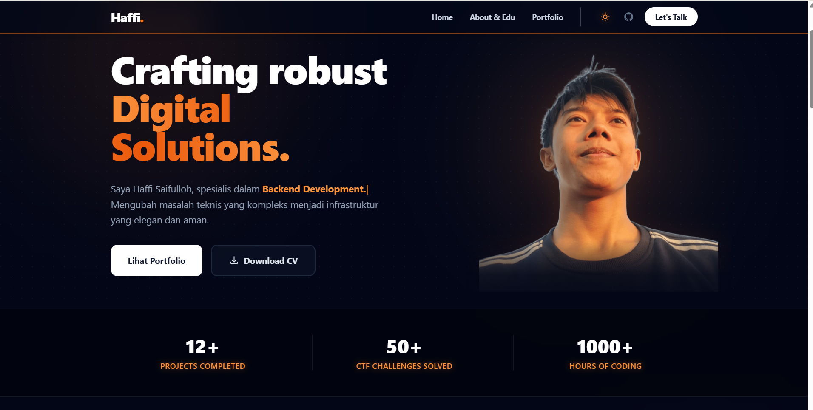
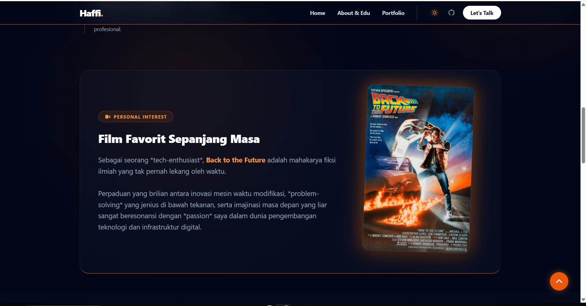

# 🚀 Portofolio Pribadi (Prak 12 PDW)

Repositori ini berisi kode sumber untuk website portofolio pribadi yang dikembangkan menggunakan **React.js**, **Vite**, dan **Tailwind CSS**. Proyek ini dibuat sebagai pemenuhan tugas Praktikum 12 Pengembangan Desain Web.

🌍 **Live Demo:** [Lihat Website Disini](https://haffi24.github.io/Prak12_PDW_20240140181/)

---

## 👤 Informasi Pengembang
- **Nama:** Haffi Saifulloh
- **NIM:** 20240140181
- **Fokus:** Backend Development, Network Engineering, & Cybersecurity

---

## ✨ Fitur Utama (Advanced UI)
Website ini mengimplementasikan berbagai fitur UI/UX modern:
1. **Dark Mode Default:** Tema gelap yang elegan sebagai bawaan, dengan tombol *toggle* mulus ke tema terang.
2. **Mouse Spotlight (Cursor Follower Glow):** Efek cahaya pendar oranye yang mengikuti pergerakan kursor mouse di latar belakang.
3. **Animated Text Gradient:** Animasi warna bergradasi yang bergerak pada teks "Digital Solutions" di Hero Section.
4. **Neon Glow & Glassmorphism:** Efek kartu tembus pandang bergaya kaca dengan pancaran bayangan neon pada bagian portofolio dan kontak.
5. **3D Hover Effect:** Interaksi memutar 3D pada gambar poster film favorit (Back to the Future).
6. **Real Downloadable CV:** Integrasi file PDF murni yang siap diunduh secara langsung.

---

## 📸 Screenshots

Berikut adalah tampilan website portofolio saya:

*(Tampilan Hero Section & Mode Gelap)*


*(Tampilan Fitur Film Favorit)*


---

## 💻 Teknologi yang Digunakan
- **Frontend Framework:** [React 19](https://react.dev/) via [Vite](https://vitejs.dev/)
- **Styling:** [Tailwind CSS 3.4](https://tailwindcss.com/)
- **Deployment:** GitHub Pages (`gh-pages`)

---

## 🚀 Cara Menjalankan Secara Lokal

Jika ingin menjalankan proyek ini di komputermu sendiri, ikuti langkah berikut:

1. **Clone repositori ini:**
```bash
   git clone [https://github.com/Haffi24/Prak12_PDW_20240140181.git](https://github.com/Haffi24/Prak12_PDW_20240140181.git)
